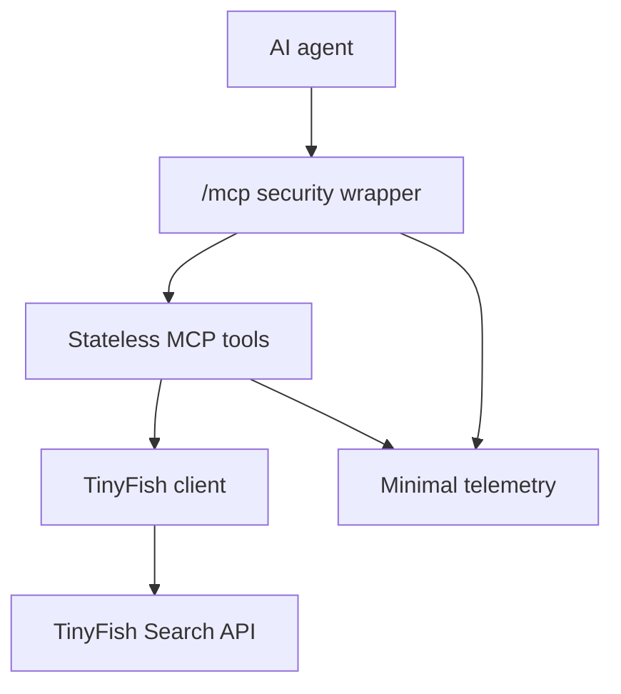

# Design: Web Search MCP

Status: Approved

Reopened: 2026-07-24 — The previous approval was invalidated because the approved tooling policy described the three `@types/*` packages only as matching stable releases. The replacement makes every direct dependency version exact while retaining the preinstalled `pnpm@10.28.1` and approved dependency-source policy.

## Design goals

- Deliver the two approved search tools through a private, stateless `/mcp` endpoint on Vercel Hobby.
- Preserve TinyFish search ranking and documented metadata while keeping tool inputs and outputs deterministic.
- Fail closed at the HTTP boundary, sanitize every tool failure, and never expose or log secrets, queries, results, or raw provider bodies.
- Keep provider work within one 10-second deadline and isolate every request so Vercel can scale invocations without shared state.
- Use current stable, mutually compatible packages and an approval-gated test and deployment workflow.

## Verified technical context

| Path or source | Verified constraint or convention |
|---|---|
| `specs/web-search-mcp/requirements.md` | Approved source of truth for scope, behavior, quality thresholds, edge cases, and exclusions. |
| [TinyFish Search API reference](https://docs.tinyfish.ai/search-api/reference) | Search uses `GET https://api.search.tinyfish.ai`, `X-API-Key`, `domain_type=web\|news`, the approved filters, page `0..10`, and structured ranked results. |
| [TinyFish authentication](https://docs.tinyfish.ai/authentication) | REST API keys belong in the `X-API-Key` header and should be supplied through `TINYFISH_API_KEY`. |
| [TinyFish error reference](https://docs.tinyfish.ai/error-codes) | TinyFish uses structured error codes; search `429` responses may include `Retry-After` and transient service failures may be retried with backoff. |
| [MCP transport specification 2025-11-25](https://modelcontextprotocol.io/specification/2025-11-25/basic/transports) | Streamable HTTP uses a single endpoint, permits JSON responses, permits `405` when no standalone SSE stream is offered, requires Origin validation, and recommends authentication. |
| [MCP TypeScript SDK v1 server guide](https://ts.sdk.modelcontextprotocol.io/server) | Stable SDK v1 supports stateless Streamable HTTP, strict tool schemas, `structuredContent`, text content, and `isError` tool results. |
| [Vercel MCP deployment guide](https://vercel.com/docs/mcp/deploy-mcp-servers-to-vercel) | Vercel supports MCP servers in Next.js route handlers and recommends Streamable HTTP for remote connections. |
| [Vercel Functions limits](https://vercel.com/docs/functions/limitations) | Current Hobby functions provide 2 GB memory and a 300-second maximum duration, well above this service’s explicit 15-second function and 10-second upstream limits. |
| [MCP TypeScript SDK repository](https://github.com/modelcontextprotocol/typescript-sdk) | `WebStandardStreamableHTTPServerTransport` supports request-local stateless operation with `sessionIdGenerator: undefined` and JSON-only responses with `enableJsonResponse: true`. |
| npm registry metadata inspected 2026-07-24 | The selected exact stable runtime versions are Next.js 16.2.11, React 19.2.8, MCP SDK 1.29.0, and Zod 4.4.3; no prerelease line is selected. |
| npm registry type-package metadata inspected 2026-07-24 | The selected exact matching stable type versions are `@types/node@24.13.3`, `@types/react@19.2.17`, and `@types/react-dom@19.2.3`. |
| User-provided implementation evidence from 2026-07-24 | The target Codex environment has Node.js 24.15.0 and preinstalled pnpm 10.28.1. Its configured proxy returns `403 Forbidden` for both the pnpm 11.17.0 tarball and ordinary npm package metadata, so neither Corepack bootstrap nor dependency resolution can use the public registry in that environment. |

## Proposed architecture

The application is a route-only Next.js service. Every HTTP method at `/mcp` passes through a small security and request-context wrapper. Each authenticated `POST` constructs a fresh official MCP `McpServer` and `WebStandardStreamableHTTPServerTransport`, handles exactly that request in JSON response mode, and closes both objects in `finally`. The two registered tools share one strict input schema and one TinyFish client. The client fixes the provider domain type according to the selected tool, performs a bounded request, validates the provider response, and returns a normalized MCP result.



There is no process-level request state, session store, database, cache, queue, browser transport, or background task. Module-level constants may hold immutable schemas and configuration names, but not request data or credentials copied outside `process.env`.

## Components and responsibilities

| ID | Component | Responsibility | Expected change |
|---|---|---|---|
| DES-001 | Next.js route and MCP transport | Expose `/mcp`, configure Node.js runtime and 15-second maximum duration, run the HTTP wrapper, and drive a request-local official SDK transport in stateless JSON mode. | Create `app/mcp/route.ts`. |
| DES-002 | HTTP security wrapper | Enforce HTTPS-origin rules, bearer authentication, method handling, no-store responses, timing-safe token comparison, and generic HTTP errors before MCP execution. | Create `src/http/security.ts` and `src/http/handler.ts`. |
| DES-003 | Runtime configuration | Read and validate `MCP_AUTH_TOKEN` and `TINYFISH_API_KEY` lazily without throwing at module import or revealing which value is absent. | Create `src/config.ts`. |
| DES-004 | MCP server and tools | Construct a request-local MCP server, advertise exactly `web_search` and `news_search`, bind strict schemas, and create success/error tool results. | Create `src/mcp/server.ts`, `src/mcp/tools.ts`, and `src/mcp/results.ts`. |
| DES-005 | Search contracts | Define strict input, normalized output, provider response, and stable tool-error schemas and TypeScript types. | Create `src/search/schemas.ts` and `src/search/types.ts`. |
| DES-006 | TinyFish client | Serialize validated inputs, fix `domain_type`, authenticate upstream, propagate cancellation, enforce the shared deadline, retry eligible failures once, and cap provider-body processing. | Create `src/search/tinyfish-client.ts`. |
| DES-007 | Error mapper | Convert validation, configuration, HTTP, network, deadline, and malformed-provider failures into the eight approved sanitized error categories. | Create `src/search/errors.ts`. |
| DES-008 | Response normalizer | Validate TinyFish success bodies, retain only approved fields, preserve ranking order and optional metadata, and serialize deterministic JSON text. | Create `src/search/normalize.ts`. |
| DES-009 | Request telemetry | Generate request IDs, extract only the MCP method/tool name after authentication, measure elapsed time, emit one allowed JSON event, and attach `X-Request-ID`. | Create `src/telemetry.ts`. |
| DES-010 | Tooling and automated verification | Use the preinstalled pinned package manager without a bootstrap download, pin dependencies, require an approved dependency source before installation, enforce strict TypeScript/lint/coverage/build gates, mock TinyFish by default, and test the HTTP-to-tool contract and concurrency. | Create project manifests, configs, and tests under `tests/`. |
| DES-011 | Operator documentation and deployment | Document environment variables, token generation, client configuration, local checks, Vercel Preview/Production rollout, smoke testing, and rollback. | Create `README.md`, `.env.example`, `.gitignore`, and deployment configuration only where Next.js defaults are insufficient. |

## Data models and state

### Search input

Both tools use one strict Zod 4 schema:

| Field | Type | Validation and normalization |
|---|---|---|
| `query` | required string | Outer-trimmed; at least one non-whitespace character. |
| `purpose` | optional string | Outer-trimmed; 1–2,000 characters when present. |
| `location` | optional string | Outer-trimmed and non-empty; case preserved. |
| `language` | optional string | Outer-trimmed and non-empty; case preserved. |
| `include_domains` | optional string | Outer-trimmed, non-empty comma-separated provider syntax; inner content and case preserved. |
| `exclude_domains` | optional string | Outer-trimmed, non-empty comma-separated provider syntax; inner content and case preserved. |
| `recency_minutes` | optional integer | Inclusive range `1..5256000`; mutually exclusive with both date fields. |
| `after_date` | optional string | Calendar-valid `YYYY-MM-DD`; no later than `before_date` when both exist. |
| `before_date` | optional string | Calendar-valid `YYYY-MM-DD`; no earlier than `after_date` when both exist. |
| `page` | optional integer | Inclusive range `0..10`. |

The schema is strict, so unknown fields—including `domain_type`, `max_results`, and wrapper-specific domain arrays—are rejected before provider work.

### Normalized search output

`SearchResponse` contains:

- `query: string`
- `results: SearchResult[]`
- `total_results: integer`
- `page: integer`

Each `SearchResult` contains required `position`, `site_name`, `title`, `snippet`, and an absolute HTTP(S) `url`, plus optional `date` and `publisher`. The normalizer constructs a new object in this field order, strips all other fields, preserves array order and supplied values, and never fabricates optional metadata. Empty arrays are valid.

### Tool error

`ToolError` is:

- `error.code`: one of `INVALID_INPUT`, `CONFIGURATION_ERROR`, `UPSTREAM_REJECTED`, `UPSTREAM_RATE_LIMITED`, `UPSTREAM_UNAVAILABLE`, `UPSTREAM_TIMEOUT`, `UPSTREAM_INVALID_RESPONSE`, or `INTERNAL_ERROR`;
- `error.message`: fixed safe text selected by category, with an invalid field path permitted for `INVALID_INPUT`;
- `error.provider_code`: optional only when the TinyFish code matches `^[A-Z0-9_]{1,64}$`;
- `error.retry_after_seconds`: optional non-negative integer parsed safely from TinyFish `Retry-After`.

The same object is returned as `structuredContent` and deterministic JSON text with `isError: true`.

### Request context

Each HTTP request owns an immutable context containing `request_id`, monotonic start time, and nullable tool name. It exists only for the request lifetime. A request-local `AbortController`/combined signal owns provider cancellation.

### Persistence

There is no application persistence, cache, query history, session state, analytics store, or migration. Vercel may retain the explicitly emitted operational log event according to the operator’s platform settings; the event contains only approved fields.

## Interfaces and APIs

### Dependency and runtime policy

`package.json` pins exact versions, declares `packageManager: "pnpm@10.28.1"`, and `pnpm-lock.yaml` is committed. Runtime dependencies are `next@16.2.11`, `react@19.2.8`, `react-dom@19.2.8`, `@modelcontextprotocol/sdk@1.29.0`, and `zod@4.4.3`. Development dependencies are `typescript@5.9.3`, `vitest@4.1.10`, `@vitest/coverage-v8@4.1.10`, `eslint@9.39.5`, `eslint-config-next@16.2.11`, `@types/node@24.13.3`, `@types/react@19.2.17`, and `@types/react-dom@19.2.3`. The runtime engine is Node.js 24 and the package manager is pnpm 10.28.1.

TypeScript 5.9.3 is selected instead of the newer TypeScript 7 line because the current stable TypeScript ESLint ecosystem declares compatibility below 6.1. Dependency upgrades, protocol-version opt-ins, and major-version changes require contract-test success and a reopened design review; the implementation does not use floating ranges or prerelease tags.

Package-manager bootstrap must be offline: implementation uses the already installed pnpm 10.28.1 and must not run Corepack, download another pnpm release, switch package managers, or alter/bypass the configured proxy. Before resolving, installing, or verifying dependencies, the implementation environment must have one approved reachable source: the configured public npm registry, an operator-approved internal npm mirror containing the exact dependency graph, or a complete pre-populated pnpm store that satisfies an offline frozen install. If none is available, dependency installation and all package-dependent tasks remain Blocked; authoring manifests without successful dependency verification does not complete the bootstrap task.

### HTTP `/mcp`

- Production transport is HTTPS.
- Every supported method first validates a present `Origin` against `new URL(request.url).origin`. No `Origin` is accepted; a mismatched present origin returns generic no-store HTTP `403`.
- If `MCP_AUTH_TOKEN` is missing, return generic no-store HTTP `503`.
- Parse exactly one bearer credential from the `Authorization` header. Hash configured and supplied UTF-8 token values with SHA-256 and compare equal-length digests using `crypto.timingSafeEqual`.
- Missing, malformed, empty, duplicated, or incorrect authorization returns generic no-store HTTP `401`.
- Authentication completes before cloning or parsing the MCP body.
- Authenticated `POST` delegates to the MCP handler.
- Authenticated `GET`, `DELETE`, `HEAD`, `OPTIONS`, `PUT`, and `PATCH` return `405` with an `Allow: POST` header. No `/sse`, `/message`, or other transport route exists.
- Every response sets `Cache-Control: no-store` and `X-Request-ID`.
- No permissive CORS headers are emitted.

### MCP transport

For every authenticated POST, the route:

1. creates `McpServer` with server name `web-search-mcp` and the package version;
2. registers the two tools through the request-local server factory;
3. creates `WebStandardStreamableHTTPServerTransport` with `sessionIdGenerator: undefined` and `enableJsonResponse: true`;
4. connects the server to the transport;
5. passes the original Web `Request` to `transport.handleRequest`;
6. adds the approved HTTP headers to the returned Web `Response`; and
7. closes the transport/server in `finally`, without retaining either object.

The route exports `runtime = "nodejs"` and `maxDuration = 15`. Stable `@modelcontextprotocol/sdk@1.29.0` behavior is used; no v2 beta or unreleased protocol opt-in is enabled. A fresh transport/server is constructed per POST, so no request depends on Vercel instance affinity. The transport returns `application/json` for MCP requests and `202` for accepted notifications; it never creates an SSE stream or session ID.

### Tool definitions

`web_search` description directs agents to ordinary websites and URL discovery. `news_search` directs agents to time-sensitive reporting and explains that publisher/date may be present. Both register the strict common input schema and normalized output schema.

The handler calls one shared function with a non-client-settable discriminant:

```text
executeSearch(kind: "web" | "news", input, context) -> ToolResult
```

The discriminant maps to `domain_type=web` or `domain_type=news`; it is never read from client arguments.

### TinyFish request

The client issues `GET https://api.search.tinyfish.ai` with:

- `URLSearchParams` for `query`, fixed `domain_type`, and only present validated filters;
- an `X-API-Key` header containing the configured TinyFish API key;
- `Accept: application/json`;
- native `fetch` with `cache: "no-store"` and a combined deadline/caller signal.

The request URL, query values, and credentials are never logged. Responses are accepted only for the documented JSON contract. Provider payload processing is capped at 1 MiB; an absent/oversized/malformed body maps to `UPSTREAM_INVALID_RESPONSE`.

## Key flows

1. **Initialization and discovery**
   1. Generate request ID and start time.
   2. Validate Origin, configuration needed for authentication, and bearer token.
   3. After authentication, inspect only the cloned JSON-RPC method and `params.name` for telemetry; discard arguments without logging.
   4. Pass the original request to the stateless MCP handler.
   5. Return the JSON MCP response with `Cache-Control: no-store` and `X-Request-ID`.
   6. Emit one sanitized telemetry event.

2. **Successful web search**
   1. `web_search` validates and normalizes its strict input.
   2. The tool obtains `TINYFISH_API_KEY`; if absent, it returns `CONFIGURATION_ERROR`.
   3. The client creates one 10-second deadline, serializes parameters, and fixes `domain_type=web`.
   4. TinyFish returns a valid success body.
   5. The normalizer strips undocumented fields while preserving ranking and values.
   6. The tool returns the object as `structuredContent` and equivalent deterministic JSON text.

3. **Successful news search**
   1. The same flow runs with `domain_type=news`.
   2. Available `date` and `publisher` values are retained per result; absent values remain absent.

4. **Transient provider failure**
   1. A transient network failure or HTTP `500/503` occurs.
   2. If the caller is still connected and the overall deadline has time remaining, wait 250 ms using the caller/deadline signal.
   3. Make exactly one second attempt with only the remaining deadline.
   4. Normalize success, or return `UPSTREAM_UNAVAILABLE` after the second eligible failure.

5. **Deadline or cancellation**
   1. A single monotonic deadline covers attempts and retry delay.
   2. At 10 seconds, abort outstanding provider work and return `UPSTREAM_TIMEOUT`.
   3. Caller cancellation aborts provider work and any retry delay immediately; if the HTTP connection is gone, no response is forced.

6. **Unauthorized or invalid-origin request**
   1. Reject at the HTTP wrapper before MCP body parsing.
   2. Make no TinyFish call.
   3. Return only the generic HTTP status and permitted headers.
   4. Emit one sanitized telemetry event with no tool name.

## Error handling

| Source | Retry | Result |
|---|---|---|
| Zod input failure | No | `INVALID_INPUT`; safe field path, no raw input value. |
| Missing `TINYFISH_API_KEY` | No | `CONFIGURATION_ERROR`; generic message. |
| TinyFish `400/401/402/403/404` or other non-429 `4xx` | No | `UPSTREAM_REJECTED`; optional allowlisted provider code only. |
| TinyFish `429` | No | `UPSTREAM_RATE_LIMITED`; optional sanitized `retry_after_seconds`. |
| TinyFish `500/503` | Once after 250 ms within deadline | Success or `UPSTREAM_UNAVAILABLE`. |
| Other TinyFish `5xx` | No | `UPSTREAM_UNAVAILABLE`. |
| Transient fetch/network failure | Once after 250 ms within deadline | Success or `UPSTREAM_UNAVAILABLE`. |
| Ten-second deadline | No further attempt | `UPSTREAM_TIMEOUT`. |
| Oversized, missing, non-JSON, or schema-invalid success body | No | `UPSTREAM_INVALID_RESPONSE`. |
| Unexpected internal failure | No | `INTERNAL_ERROR`; fixed message. |

Only retry eligibility, not provider text, controls retry behavior. `Retry-After` accepts a valid non-negative delta-seconds value; invalid values are omitted. Raw error bodies are bounded/discarded and never returned or logged.

## Security and privacy

- Trust boundaries are the external MCP client, Vercel function runtime, and TinyFish Search API.
- The bearer token protects the route but is not an OAuth system and grants no scopes or identity.
- Token comparison uses SHA-256 digests and `timingSafeEqual`; comparison does not short-circuit on token contents.
- The Origin rule follows the stable MCP transport specification: absent is accepted for non-browser agents, present must equal the endpoint origin, otherwise `403`.
- `MCP_AUTH_TOKEN` and `TINYFISH_API_KEY` are read only server-side from Vercel environment variables. `.env.example` contains names only; `.env*` containing values is ignored by Git.
- HTTP and tool error messages are fixed and sanitized. No exception message, stack, header, body, query, result, credential, or provider payload reaches application logs.
- Responses are `no-store`; no CDN caching or application caching is enabled.
- The service does not follow result URLs, eliminating server-side request forgery through search results.
- No permissive CORS policy, browser UI, OAuth discovery, or public metadata endpoint is added.
- The README instructs the operator to create a high-entropy token, configure Preview and Production separately, and rotate the token after suspected exposure.

## Performance and reliability

- Vercel Node.js Function maximum duration is explicitly 15 seconds; TinyFish work has a stricter shared 10-second deadline.
- The implementation has no database/network dependency other than TinyFish and no application queue.
- Five concurrent calls remain independent; immutable schemas may be shared, but transports, abort signals, request IDs, inputs, outputs, and telemetry contexts are request-local.
- The service adds no intentional delay except the one 250 ms eligible retry delay.
- The design does not implement an application rate limiter because the service is stateless and single-tenant; TinyFish enforces account quota. `429` is propagated as a safe agent-readable tool error without retry.
- A 1 MiB upstream body cap bounds memory consumed by a malformed provider response.
- Empty search results are successful and do not trigger retries.
- Vercel instance recycling or horizontal scaling is safe because no session or mutable process state is required.

## Observability

The HTTP wrapper emits exactly one JSON object per request after completion or rejection:

```json
{
  "request_id": "uuid",
  "tool": "web_search",
  "status": "success",
  "elapsed_ms": 1234,
  "error_code": null
}
```

- `tool` is `web_search`, `news_search`, or `null`.
- `status` is a small fixed category such as `success`, `tool_error`, `unauthorized`, `forbidden`, `misconfigured`, `protocol_error`, or `cancelled`.
- `error_code` is absent/null or one of the approved sanitized tool error codes.
- The UUID is generated by `crypto.randomUUID()` and returned in `X-Request-ID`.
- `elapsed_ms` comes from a monotonic clock and is rounded to a non-negative integer.
- No SDK logging capability is registered or invoked, and application code never calls a logger with arbitrary errors or payloads.
- No metric, trace exporter, analytics SDK, or alert is added in v1. Operators diagnose failures by filtering Vercel runtime logs on the five permitted fields.

## Testing strategy

### Unit tests

- Strict schema types, trimming, empty strings, purpose length, numeric ranges, real calendar dates, mutual exclusions, date ordering, unknown fields, and domain-type override attempts.
- Success normalization, optional news metadata, empty results, stable field order, URL rejection, undocumented-field stripping, oversized body rejection, and deterministic JSON text.
- Every HTTP/TinyFish/network/deadline error mapping and provider-code allowlist.
- Token parsing, duplicated/malformed headers, absent config, SHA-256 timing-safe comparison behavior, Origin policy, and no-store headers.
- Retry count, 250 ms delay, shared deadline, insufficient remaining time, deadline abort, and caller cancellation using injected fake clock/sleep/fetch dependencies.
- Telemetry field allowlist and explicit tests that forbidden strings never appear.

### Handler-level contract tests

- Initialize, list tools, and call both tools through `/mcp` using an MCP client or protocol fixtures.
- Verify exactly two tools and their schemas.
- Verify `domain_type` is fixed for each tool and every supplied filter appears once in the TinyFish URL.
- Verify equivalent `structuredContent` and parsed text fallback.
- Verify authenticated `GET/DELETE` return `405`, bad Origin returns `403`, bad bearer returns `401`, and missing auth config returns `503`.
- Verify missing TinyFish config permits discovery but tool calls return `CONFIGURATION_ERROR`.
- Verify five simultaneous calls do not share inputs, outputs, abort signals, or request IDs.
- Exercise 30 mocked calls at the approved aggregate rate with no internal queuing.

### Quality gate

- `pnpm --version` must report `10.28.1` without a download or activation step.
- `pnpm install --frozen-lockfile` must succeed through the configured approved registry/mirror or from a complete pre-populated store using pnpm’s offline mode.
- `pnpm lint`
- `pnpm typecheck`
- `pnpm test --coverage`
- `pnpm build`

Coverage must be 100% branch coverage for authentication, validation, retry/deadline, and error mapping, with at least 90% statements overall. CI and the default test suite use a mocked `fetch`, require no production secret, and make no live TinyFish request. A registry/proxy failure is an environment prerequisite failure, not permission to skip installation, omit the lockfile, change an exact version, or weaken a quality gate.

### Deployment smoke test

An explicit opt-in script accepts a deployment URL and non-production bearer token. It verifies rejection without auth, initialization/tool discovery with auth, one fixed benign `web_search`, and one fixed benign `news_search`. It uses the configured preview TinyFish key and never runs in default CI.

## Migration, rollout, and rollback

There is no schema or data migration.

1. Verify Node.js 24 and the already installed pnpm 10.28.1 without invoking Corepack or downloading a package manager.
2. Verify that an approved registry/mirror is reachable or that a complete offline pnpm store is available. Stop as Blocked if no approved dependency source can satisfy the exact graph.
3. Pin the approved stable dependency versions, generate and commit `pnpm-lock.yaml` with pnpm 10.28.1, and prove a frozen install.
4. Run all local quality gates with no live credentials.
5. Create a Vercel Preview deployment on the Hobby plan.
6. Configure separate Preview values for `MCP_AUTH_TOKEN` and `TINYFISH_API_KEY`; never copy values into repository files or logs.
7. Run the opt-in Preview smoke test and inspect sanitized runtime logs for only the permitted fields.
8. Promote the exact verified deployment to Production after smoke success.
9. Configure/verify Production secrets and repeat the minimal production smoke test.
10. Roll back by restoring the previous known-good Vercel production deployment. Because there is no state or migration, no data rollback is required.
11. Rotate `MCP_AUTH_TOKEN` after suspected exposure; rotate the TinyFish key if that credential is suspected exposed.

## Alternatives considered

| Alternative | Advantages | Disadvantages | Reason rejected |
|---|---|---|---|
| Vercel `mcp-handler` adapter | Vercel-oriented convenience wrapper and simple registration. | Version 1.1.0 constructs the SDK transport without `enableJsonResponse`, whose default is false, so POST responses use SSE; it also includes unused Redis/legacy transport code. | It cannot implement the confirmed JSON-only transport without relying on undocumented internals. |
| Edge runtime | Lower cold-start latency and Web-standard APIs. | Tighter runtime constraints and no benefit for a 1–3 second upstream search. | Node.js 24 is fully supported by the chosen stable packages and simplifies timing-safe auth and testing. |
| Stateful Streamable HTTP with Redis | Sessions, resumability, and server notifications. | Adds paid/external storage, mutable state, operational complexity, and legacy transport surface. | The approved tools are request/response operations and explicitly require no persistence or queue. |
| SSE response mode | Supports progress and server-to-client messages. | Longer connections and behavior not needed by either search tool. | JSON response mode satisfies the approved stateless agent contract. |
| OAuth 2.1 | Per-client identity, scopes, and standardized authorization discovery. | More endpoints, credentials, state, and user flows. | The approved service is private, single-tenant, and uses one shared token. |
| TinyFish SDK | Provider-maintained types and convenience retry behavior. | Less control over the single shared deadline, exact retries, response cap, normalization, and logging. | Native `fetch` gives the precise approved failure and privacy behavior for one simple GET endpoint. |
| Zod 3.25 | Supported by the MCP SDK and familiar to older integrations. | Older major with no compatibility advantage after removing `mcp-handler`. | Zod 4.4.3 is a current stable peer supported directly by MCP SDK 1.29.0. |
| Download pnpm 11.17.0 with Corepack | Preserves the former package-manager pin. | Requires registry access during package-manager bootstrap and fails through the target environment’s configured proxy. | The preinstalled pnpm 10.28.1 supports the required project workflow without a bootstrap download. |
| Continue without an approved dependency source | Allows source drafting while the registry is unavailable. | Cannot generate or verify the exact lockfile, install dependencies, run tests, or prove the production build. | Unverified source would not satisfy the approved reproducibility and release gates; package-dependent work remains Blocked instead. |
| Use Vercel Preview to install without a committed lockfile | May shift dependency downloads to a networked build environment. | Produces an unlocked transitive graph and prevents local frozen-install verification of the exact deployed source. | The selected policy requires a committed lockfile and successful frozen install before Preview deployment. |
| Application rate limiter or semaphore | Can enforce exact local quotas and concurrency. | Requires shared state or creates an internal queue/refusal policy not approved for this stateless service. | Capacity is a support target; TinyFish remains the quota authority. |
| Permissive Origin allowlist | Enables browser-hosted cross-origin clients. | Adds configuration and broadens browser attack surface. | Intended agents are server-to-server and can omit Origin; exact same-origin validation follows the approved policy. |

## Design risks

| ID | Risk | Mitigation |
|---|---|---|
| DRISK-001 | A request-local MCP server/transport may leak resources if an exception bypasses cleanup. | Construct both inside the POST handler, close them in `finally`, and test cleanup after success, tool error, protocol error, timeout, and cancellation. |
| DRISK-002 | Adapter or SDK updates may change protocol negotiation or response shapes. | Pin exact compatible versions, commit the lockfile, use contract tests, and require a new design review before a major/protocol upgrade. |
| DRISK-003 | Next.js/Vercel proxy URL reconstruction could cause an Origin mismatch on a custom domain. | Compare against the canonical `Request.url` seen by the route and verify same-origin, absent-origin, and mismatched-origin behavior on Preview before Production. |
| DRISK-004 | A cold start plus two provider attempts could approach the route duration. | Keep imports small, use a 10-second provider deadline and 15-second route duration, and never begin a retry without remaining budget. |
| DRISK-005 | TinyFish may return a documented field in an unexpected type or omit a required field. | Validate and cap the body, return `UPSTREAM_INVALID_RESPONSE`, and never guess or synthesize data. |
| DRISK-006 | Minimal logs reduce forensic detail. | Preserve request ID, tool, outcome, latency, and stable error category; use deterministic tests and opt-in smoke tests rather than sensitive production payload logging. |
| DRISK-007 | A client may not support custom bearer headers or JSON Streamable HTTP. | State these client prerequisites in README and verify with a standards-compliant client before rollout; do not add excluded transports or OAuth implicitly. |
| DRISK-008 | The shared bearer token may be brute-forced or leaked. | Require a high-entropy token, timing-safe comparison, HTTPS, no logs/cache, generic failures, and operator rotation on suspicion. |
| DRISK-009 | The configured proxy may prevent access to every approved dependency source, even though pnpm itself is installed. | Treat dependency-source access as an explicit bootstrap prerequisite; use only an operator-approved registry/mirror or complete offline store, record sanitized failure evidence, and keep package-dependent work Blocked without substitution or proxy bypass. |

## Requirements traceability

| Requirement | Design decisions | Coverage explanation |
|---|---|---|
| REQ-F-001 | DES-001, DES-004 | The Next.js route and request-local official SDK transport expose stateless JSON Streamable HTTP at `/mcp`. |
| REQ-F-002 | DES-002, DES-003 | The security wrapper validates bearer auth before body parsing or TinyFish access and returns generic `401`. |
| REQ-F-003 | DES-004 | The request-local MCP server registers exactly `web_search` and `news_search`. |
| REQ-F-004 | DES-004, DES-005 | The shared strict input schema defines every approved scalar field and no others. |
| REQ-F-005 | DES-005 | Zod refinements enforce all type, bound, calendar, exclusivity, and ordering rules before provider work. |
| REQ-F-006 | DES-004, DES-006 | The web tool passes an internal `"web"` discriminant that becomes fixed `domain_type=web`. |
| REQ-F-007 | DES-004, DES-006 | The news tool passes an internal `"news"` discriminant that becomes fixed `domain_type=news`. |
| REQ-F-008 | DES-005, DES-008 | The normalized response schema retains approved core and optional news fields in provider order. |
| REQ-F-009 | DES-004, DES-008 | Tool results return the normalized object as `structuredContent` and deterministic JSON text. |
| REQ-F-010 | DES-005, DES-008 | The output schema accepts and returns an empty results array as success. |
| REQ-F-011 | DES-004, DES-005, DES-007 | The stable error schema and mapper create sanitized `isError` tool results. |
| REQ-F-012 | DES-002, DES-003, DES-007, DES-009 | Security, errors, and logging explicitly exclude credentials, headers, raw bodies, and arbitrary exception content. |
| REQ-F-013 | DES-006, DES-007 | One shared 10-second deadline and one eligible retry implement bounded transient recovery. |
| REQ-F-014 | DES-006, DES-007 | The status mapper never retries `4xx`; `429` safely parses only `Retry-After`. |
| REQ-F-015 | DES-002, DES-003, DES-004 | Lazy configuration returns generic HTTP `503` for missing auth config and `CONFIGURATION_ERROR` for missing provider config. |
| REQ-F-016 | DES-009 | The single allowlisted JSON event contains only the five approved telemetry fields. |
| REQ-F-017 | DES-001, DES-004, DES-006 | The route, MCP server, and provider client retain no session, query, result, authorization, or credential state. |
| REQ-NF-001 | DES-001, DES-010, DES-011 | Node.js/Next.js route-only deployment uses no paid Vercel service and is verified on Hobby Preview. |
| REQ-NF-002 | DES-001, DES-004, DES-010 | Stable SDK Streamable HTTP behavior is covered by initialization, discovery, and call contract tests. |
| REQ-NF-003 | DES-002, DES-003, DES-010 | Timing-safe bearer validation, server-side configuration, fail-closed behavior, and tests establish the security boundary. |
| REQ-NF-004 | DES-002, DES-003, DES-009, DES-010 | No-store/no-persistence design and telemetry leak tests enforce the privacy requirement. |
| REQ-NF-005 | DES-006, DES-007, DES-010 | Shared deadline logic aborts work at 10 seconds and is verified with a fake clock. |
| REQ-NF-006 | DES-006, DES-010 | Stateless concurrent execution and mocked capacity tests verify five simultaneous and 30-per-minute calls without a queue. |
| REQ-NF-007 | DES-001, DES-004, DES-006, DES-009 | Request-local server, transport, signal, context, and output isolate every failure and cancellation. |
| REQ-NF-008 | DES-005, DES-007, DES-008, DES-010 | Exact schemas/error categories plus required contract tests and coverage gates protect the public contract. |
